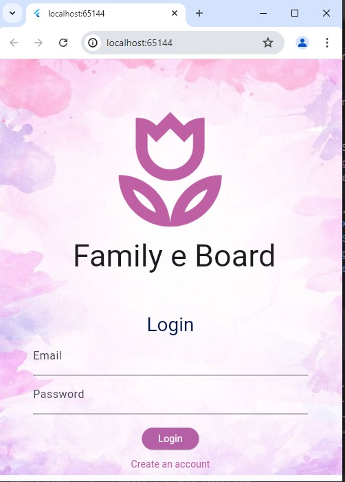
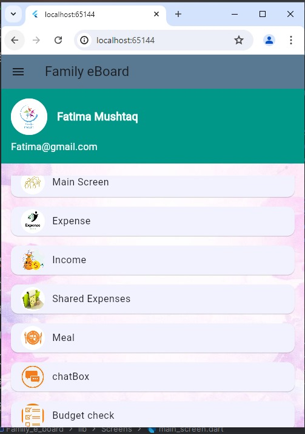
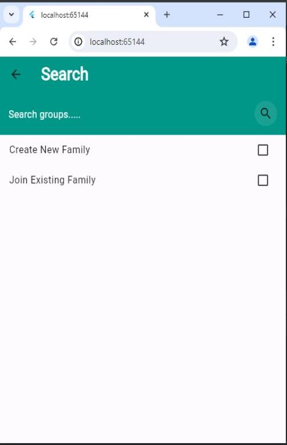
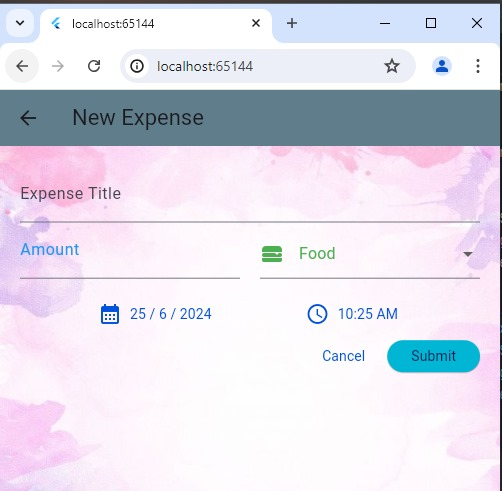
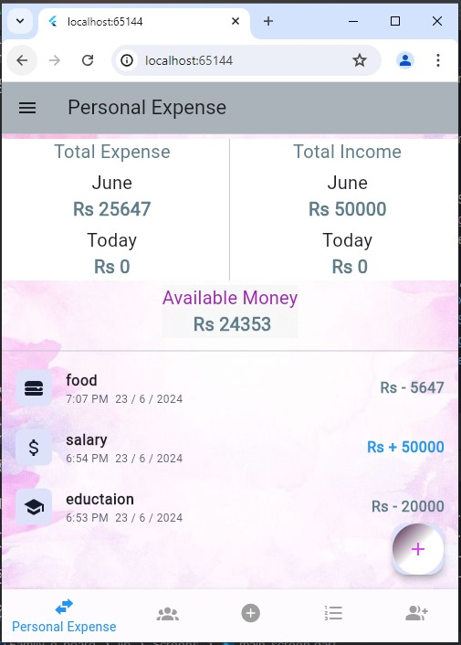
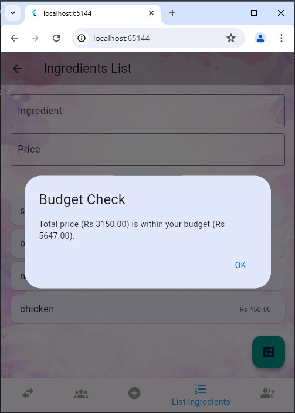
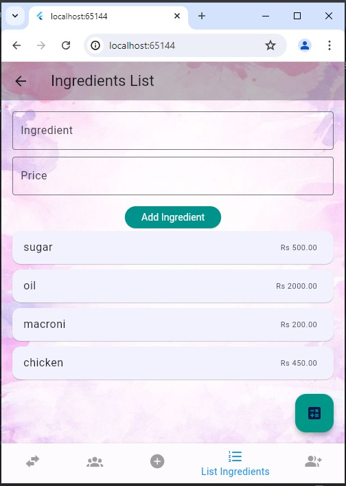
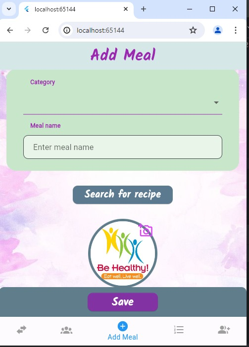

# 🏠 Family E-Board

> A modern Flutter application that helps families organize everyday life in one place—from expense tracking and budgeting to grocery lists and meal planning.

<p align="center">
  
  
  
  
</p>

---

## ✨ Features

- 🔐 Secure Firebase Authentication
- 👨‍👩‍👧 Family Dashboard
- 💰 Expense Tracking
- 📊 Budget Management
- 🛒 Grocery Lists
- 🍽️ Meal Planning
- ☁️ Cloud Firestore Synchronization
- 📱 Responsive Flutter UI

---

## 🖼️ Screenshots

<p align="center">





</p>

<p align="center">





</p>

<p align="center">




</p>

---

## 🏗️ Architecture

```
                     Flutter App
                           │
                Provider State Management
                           │
         ┌─────────────────┴────────────────┐
         │                                  │
 Firebase Authentication          Cloud Firestore
         │                                  │
         └───────────────┬──────────────────┘
                         │
               Family Management Modules
                         │
     Expenses • Budget • Grocery • Meals
```

---

## 🛠️ Tech Stack

| Technology | Purpose |
|------------|---------|
| Flutter | Cross-platform UI |
| Dart | Programming Language |
| Firebase Authentication | User Authentication |
| Cloud Firestore | Cloud Database |
| Provider | State Management |

---

## 📂 Project Structure

```text
lib/
├── models/
├── providers/
├── screens/
├── services/
├── widgets/
└── main.dart
```

---

## 🚀 Getting Started

```bash
git clone https://github.com/Huma-ashfaq/family_e_boardd.git
cd family_e_boardd

flutter pub get

flutter run
```

---

## 📌 Future Improvements

- Push Notifications
- Shared Family Calendar
- Dark Mode
- Bill Reminders
- Offline Support
- Data Export

---

## 👩‍💻 Author

**Huma Ashfaq**

Flutter Developer

---

<p align="center">

Made with ❤️ using Flutter & Firebase

</p>
